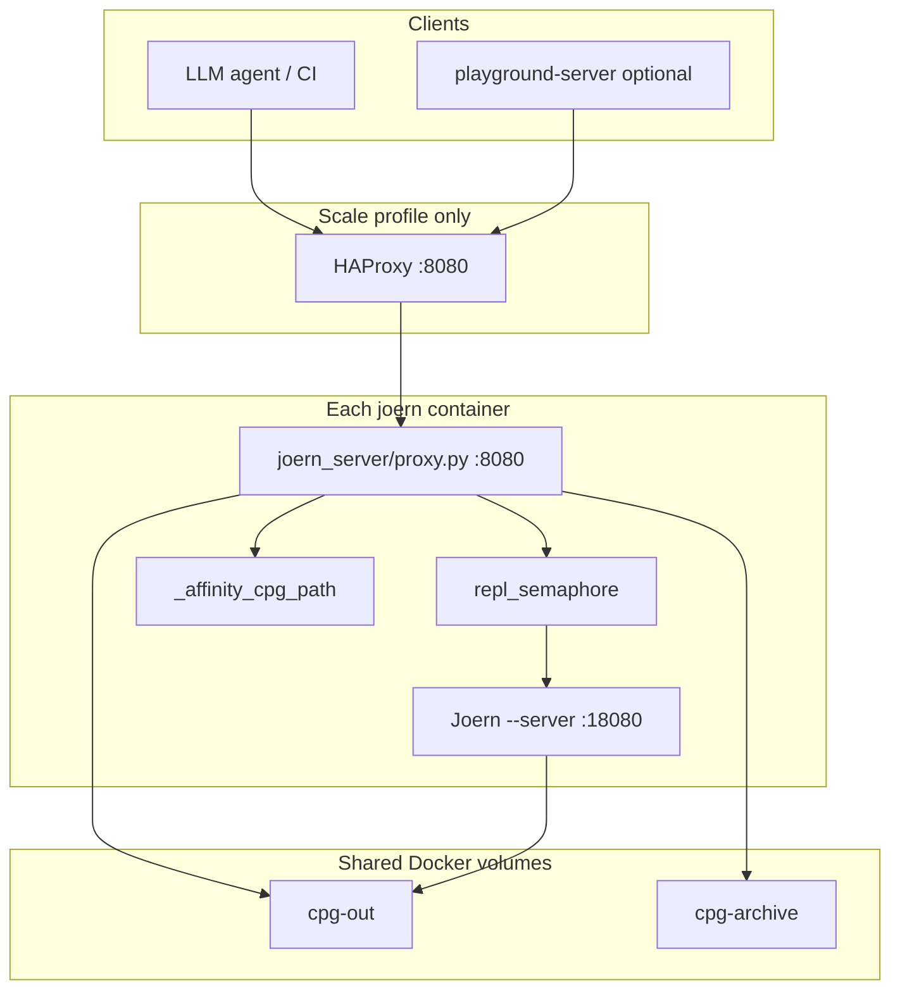
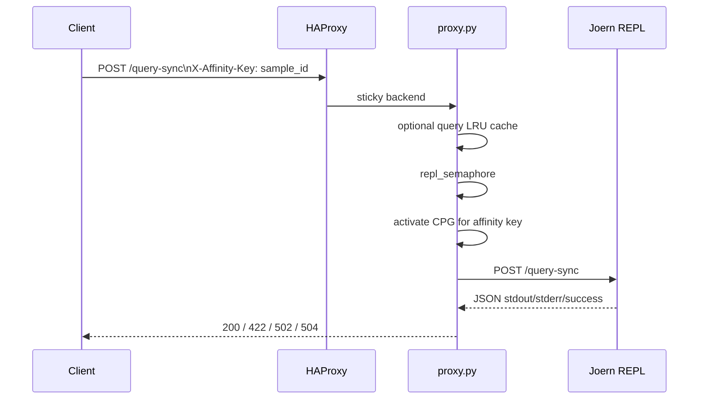

# Architecture

Joern Server exposes Joern as an **HTTP API** on port **8080**. Each container runs a **Python proxy** in front of a **single Joern REPL** (JVM). Multi-replica deployments use **HAProxy** with sticky routing so each `sample_id` stays on one replica.

---

## System context



| Profile | Entry | Replicas |
|---------|-------|----------|
| Dev | `deploy/compose.dev.yml` | 1 |
| Scale | `deploy/compose.scale.yml` + HAProxy | N (`--scale joern=N`) |

---

## Process model (one container)

Started by `docker/unified-entrypoint.sh`:

1. Start Joern `--server` on `JOERN_INTERNAL_PORT` (default **18080**).
2. Wait until Joern accepts `POST /query-sync` with `val _health = 1`.
3. Start `python3 /app/joern_server/proxy.py` on **8080** (`PYTHONPATH=/app`).
4. Supervise: if Joern exits, restart Joern and proxy (bounded by `JOERN_MAX_RESTARTS`).

| Process | Port | Role |
|---------|------|------|
| Joern JVM | 18080 (internal) | CPGQL REPL; one active CPG in memory |
| Python proxy | 8080 (published via HAProxy in scale) | HTTP API, parse subprocess, affinity map |

Clients never connect to 18080 directly.

---

## Request flow: `/query-sync`



| Step | Behavior |
|------|----------|
| Cache | Optional LRU keyed by `{affinity_key}:{md5(query)}`; off when `QUERY_CACHE_MAX_SIZE=0` |
| Semaphore | `repl_semaphore(1)` — one REPL operation at a time per container |
| Activation | If affinity key has a stored `importCpg` path, proxy re-imports before forwarding |
| Errors | Joern `success=false` at HTTP 200 → **422**; timeout → **504**; upstream down → **502** with `code` |

---

## HTTP headers

Two headers serve different purposes.

| Header | Typical value | Purpose |
|--------|---------------|---------|
| `X-Session-Id` | Agent run UUID | Logging; forwarded to Joern |
| `X-Affinity-Key` | `sample_id` | HAProxy stickiness, `_affinity_cpg_path`, query cache |

HAProxy stickiness order (`deploy/haproxy.cfg`):

1. `X-Affinity-Key`
2. `X-Session-Id` (fallback)
3. Client IP (fallback)

**Rule for clients:** after `POST /parse`, send the same `X-Affinity-Key: <sample_id>` on every `/query-sync` and `/cleanup` for that CPG.

Optional: `X-Request-Id` for correlation (returned on error responses).

---

## Parse pipeline (stateless)

| Endpoint | Input | Output |
|----------|-------|--------|
| `POST /parse` | JSON `source_code` | `/workspace/cpg-out/<sample_id>/` |
| `POST /parse/repo` | NDJSON or `upload_id` | One CPG per repo |
| `POST /parse/repo/upload` | Multipart archive | Staged under `repo-uploads/` |

Parse runs `joern-parse` in a **subprocess** (not under `repl_semaphore`). Any replica can parse; output is visible on all replicas via the shared **`cpg-out`** volume.

**Parse deduplication:** `CPGRegistry` keys archives by `source_hash` (SHA-256 of source). Cache hits copy from `cpg-archive` to `cpg-out`.

---

## Storage

| Path | Scope | Purpose |
|------|-------|---------|
| `/workspace/cpg-out/<sample_id>/` | Shared volume | Built CPG directories |
| `/workspace/cpg-archive/` | Shared volume | Archived CPGs by `source_hash` |
| `/workspace/repo-uploads/<upload_id>/` | Shared volume | Staged uploads (TTL) |
| `_affinity_cpg_path` | Per replica (RAM) | Affinity key → last successful `importCpg` path |

Reference CPGs in CPGQL:

```scala
importCpg("/workspace/cpg-out/my-sample")
```

---

## Cleanup

`POST /cleanup` with `sample_id`:

1. Delete or archive files under `cpg-out/<sample_id>` (optional `archive: true`).
2. Remove matching entries from `_affinity_cpg_path`.
3. Best-effort `close` on the REPL if that CPG was active.

After cleanup, run `importCpg` again before further queries.

---

## Concurrency and capacity

| Constraint | Implication |
|------------|-------------|
| One REPL per container | All affinity keys on that replica share one JVM graph at a time |
| `repl_semaphore(1)` | Queries serialize per replica |
| Stickiness | N parallel **active** CPG workloads need up to N replicas (with even spread) |

Example: 8 parallel sessions on 10 replicas ≈ low queue depth if affinity keys are distinct and spread evenly.

---

## Health and metrics

| Endpoint | Behavior |
|----------|----------|
| `GET /health` | Probes internal Joern; **200** + `joern_ok: true` or **503** |
| `GET /metrics` | Prometheus text format (`joern_proxy_*`) |
| `GET /cache-metrics` | LRU stats when query cache enabled |
| `GET /version` | Forwards `version` query to Joern |

Docker healthcheck uses `POST /query-sync` (same as deep health). HAProxy uses `GET /health`.

Optional monitoring: `deploy/compose.monitoring.yml` (Prometheus + Grafana).

---

## API surface (summary)

| Method | Path | Stateful |
|--------|------|----------|
| GET | `/health`, `/version`, `/metrics`, `/cache-metrics` | No |
| POST | `/parse`, `/parse/repo`, `/parse/repo/upload` | No |
| POST | `/query-sync` | Yes (affinity) |
| POST | `/graph/cfg`, `/dfg`, `/ddg`, `/pdg`, `/ast` | Yes (use `/query-sync` to import first) |
| POST | `/cleanup` | No (clears affinity) |

Details: [API reference](api_reference.md), [Query guide](query_guide.md).

---

## Related

- [Deployment](deploy.md)
- [Developer guide](developer_guide.md)
