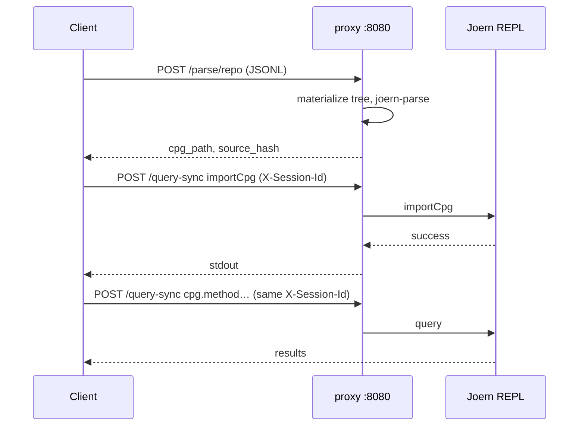

# Joern HTTP client guide

Copy-paste examples for the **approved** Sprint 9 HTTP API. The proxy listens on **`http://<host>:8080`** (or your HAProxy VIP).

**Prerequisites:** Service running ([deploy/README.md](../deploy/README.md)). Set auth if configured:

```bash
export JOERN_URL=http://127.0.0.1:8080
export JOERN_AUTH="-u joern:change-me"   # omit if auth disabled
export SESSION=my-run-$(date +%s)
```

Full API details: [`.pms/docs/api/http_api.md`](../.pms/docs/api/http_api.md). Architecture: [ARCHITECTURE.md](ARCHITECTURE.md).

---

## Quick start

### Health

```bash
curl -s $JOERN_AUTH "$JOERN_URL/health"
# → {"ok": true}
```

### Parse a single file (`POST /parse`)

Use for snippets, one-off samples, or quick tests (&lt;~200 LOC).

```bash
curl -s $JOERN_AUTH \
  -H 'Content-Type: application/json' \
  -d '{
    "sample_id": "demo-snippet",
    "language": "c",
    "filename": "main.c",
    "source_code": "#include <stdio.h>\nint main(){ puts(\"hi\"); return 0; }",
    "overwrite": true
  }' \
  "$JOERN_URL/parse" | jq .
```

Response includes `cpg_path` (e.g. `/workspace/cpg-out/demo-snippet`), `source_hash`, `cache_hit`.

### Parse a repository (`POST /parse/repo` — JSONL)

**One request → one CPG** for the whole tree. Query params carry metadata; body is NDJSON.

```bash
# Build JSONL on stdin (see Python helper below), then:
curl -s $JOERN_AUTH -X POST \
  "$JOERN_URL/parse/repo?sample_id=my-app&language=c&overwrite=false" \
  -H 'Content-Type: application/x-ndjson' \
  --data-binary @repo.ndjson | jq .
```

Each line:

```json
{"path":"src/main.c","content":"#include <stdio.h>\n..."}
{"path":"include/util.h","content":"#ifndef UTIL_H\n..."}
```

Rules: `path` is relative POSIX (no `..`, no leading `/`). `content` is UTF-8.

### Parse a heavy repo (upload, two steps)

**Step 1 — stage archive**

```bash
curl -s $JOERN_AUTH -X POST \
  "$JOERN_URL/parse/repo/upload" \
  -F 'archive=@/path/to/my-repo.zip' | jq .
# → { "ok": true, "upload_id": "...", "expires_at": "...", "bytes_stored": ... }
```

**Step 2 — parse from `upload_id`**

```bash
UPLOAD_ID=550e8400-e29b-41d4-a716-446655440000

curl -s $JOERN_AUTH \
  -H 'Content-Type: application/json' \
  -d "{
    \"sample_id\": \"my-app\",
    \"upload_id\": \"$UPLOAD_ID\",
    \"language\": \"c\",
    \"overwrite\": false
  }" \
  "$JOERN_URL/parse/repo" | jq .
```

Supported archives: `.zip`, `.tar.gz`. Staging path: `/workspace/repo-uploads/<upload_id>/` until expiry (default 24h).

### Load CPG and query (`importCpg` + `/query-sync`)

Parsing does **not** load the graph into the REPL. After parse, import once per session, then query many times.

```bash
CPG_PATH=/workspace/cpg-out/my-app   # from parse response cpg_path

# Import (binds CPG to this session)
curl -s $JOERN_AUTH \
  -H 'Content-Type: application/json' \
  -H "X-Session-Id: $SESSION" \
  -d "{\"query\":\"importCpg(\\\"$CPG_PATH\\\")\"}" \
  "$JOERN_URL/query-sync" | jq .

# Query
curl -s $JOERN_AUTH \
  -H 'Content-Type: application/json' \
  -H "X-Session-Id: $SESSION" \
  -d '{"query":"cpg.method.name.take(20).l"}' \
  "$JOERN_URL/query-sync" | jq .
```

### Graph endpoint (optional)

After `importCpg`, structured CFG JSON without hand-parsing DOT:

```bash
curl -s $JOERN_AUTH \
  -H 'Content-Type: application/json' \
  -H "X-Session-Id: $SESSION" \
  -d '{"method_full_name":"main:int()"}' \
  "$JOERN_URL/graph/cfg" | jq .
```

---

## Build JSONL from a local directory (Python)

```python
#!/usr/bin/env python3
"""Walk a repo and print NDJSON lines for POST /parse/repo."""
import json
import sys
from pathlib import Path

def iter_files(root: Path, extensions: set[str] | None = None):
    for path in root.rglob("*"):
        if not path.is_file():
            continue
        if extensions and path.suffix.lower() not in extensions:
            continue
        rel = path.relative_to(root).as_posix()
        yield rel, path.read_text(encoding="utf-8", errors="replace")

def main():
    if len(sys.argv) < 2:
        print("usage: build_repo_ndjson.py <repo_root> [ext ...]", file=sys.stderr)
        sys.exit(1)
    root = Path(sys.argv[1]).resolve()
    exts = {e if e.startswith(".") else f".{e}" for e in sys.argv[2:]} or None
    for rel, content in iter_files(root, exts):
        print(json.dumps({"path": rel, "content": content}, ensure_ascii=False))

if __name__ == "__main__":
    main()
```

Usage:

```bash
python3 build_repo_ndjson.py ./my-repo .c .h > repo.ndjson

curl -s $JOERN_AUTH -X POST \
  "$JOERN_URL/parse/repo?sample_id=my-app&language=c&overwrite=false" \
  -H 'Content-Type: application/x-ndjson' \
  --data-binary @repo.ndjson
```

Shell one-liner (small trees only):

```bash
find ./my-repo -type f \( -name '*.c' -o -name '*.h' \) | while read -r f; do
  python3 -c "import json,sys; p=sys.argv[1]; print(json.dumps({'path': p, 'content': open(sys.argv[2]).read()}))" \
    "${f#./my-repo/}" "$f"
done > repo.ndjson
```

---

## When to use which mode

| Goal | Use |
|------|-----|
| Single file, quick test | `POST /parse` |
| Remote machine, full project, &lt; limits | `POST /parse/repo` (JSONL) |
| Large repo, flaky network, already zipped | Upload + `POST /parse/repo` with `upload_id` |
| Dataset already on server volume | `POST /parse/repo` with `source_root` (ops only) |

---

## Sticky sessions (scaled deploy)

Behind HAProxy with multiple Joern replicas:

1. Generate a stable `X-Session-Id` per analysis conversation (UUID is fine).
2. Send it on **every** `/query-sync` and `/graph/*` request after `importCpg`.
3. If the header is missing, routing may fall back to source-IP affinity and CPG state can appear “lost” when requests hit different replicas.

Parse calls do not require stickiness; import + query do.

```python
import uuid
import requests

SESSION = str(uuid.uuid4())
HEADERS = {"Content-Type": "application/json", "X-Session-Id": SESSION}
```

---

## Error codes

Errors return JSON: `{"error": "<message>", "code": "<code>"}`.

| HTTP | `code` | Typical cause |
|------|--------|----------------|
| 400 | `bad_request` | Malformed JSON, missing fields |
| 400 | `invalid_path` | `..`, absolute path, or illegal characters in repo `path` |
| 400 | `empty_tree` | No files after JSONL/upload ingest |
| 400 | `invalid_source_root` | Ops `source_root` outside allow-list |
| 401 | — | Missing or wrong HTTP Basic credentials |
| 404 | `upload_not_found` | Unknown `upload_id` |
| 409 | `cpg_exists` | `/workspace/cpg-out/<sample_id>` exists and `overwrite=false` |
| 410 | `upload_expired` | Past `expires_at` for staged archive |
| 413 | `payload_too_large` | File count, byte total, or archive over limit |
| 422 | `session_cpg_activation_failed` | Proxy could not re-activate session CPG |
| 422 | `query_failed` / Joern `success: false` | Invalid CPGQL or query error |
| 504 | `parse_timeout` | `joern-parse` exceeded timeout |
| 504 | `query_timeout` | REPL query exceeded proxy timeout |

Repo limits (env-configurable, defaults in API doc): `PARSE_REPO_MAX_FILES`, `PARSE_REPO_MAX_BYTES`, `PARSE_REPO_MAX_ARCHIVE_MB`, `JOERN_PARSE_REPO_TIMEOUT_SEC`.

---

## End-to-end workflow



---

## Further reading

- [ARCHITECTURE.md](ARCHITECTURE.md) — components, storage, session model
- [deploy/README.md](../deploy/README.md) — compose, env vars, memory tuning
