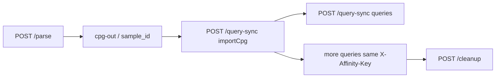

# Query and parsing guide

How to ingest source code, bind CPGs to sessions, run CPGQL, and clean up.

---

## 1. Parsing (ingestion)

### Single snippet — `POST /parse`

For one file or a small fragment:

```json
{
  "sample_id": "my-snippet",
  "source_code": "int add(int a, int b) { return a + b; }",
  "language": "c",
  "overwrite": true
}
```

Language aliases (e.g. `python` → `pythonsrc`) are normalized in the proxy. See `joern_server/proxy.py` `_LANGUAGE_ALIASES`.

### Repository — `POST /parse/repo` (NDJSON)

One CPG for the whole tree. Each line is one file:

```json
{"path": "src/main.c", "content": "#include <stdio.h>\n..."}
{"path": "src/util.c", "content": "..."}
```

```bash
curl -s -X POST \
  "http://127.0.0.1:8080/parse/repo?sample_id=my-project&language=c&overwrite=true" \
  -H 'Content-Type: application/x-ndjson' \
  --data-binary @repo.ndjson
```

**Anti-pattern:** calling `POST /parse` once per file in a multi-file project. That creates unrelated CPGs. Use repo ingest instead.

### Large upload — `POST /parse/repo/upload`

1. Upload archive → receive `upload_id`
2. `POST /parse/repo` with JSON `{"sample_id": "...", "upload_id": "..."}`

---

## 2. Headers: session vs affinity

| Header | Set to | Required when |
|--------|--------|----------------|
| `X-Affinity-Key` | `sample_id` | Every `/query-sync`, `/graph/*`, `/cleanup` for that CPG |
| `X-Session-Id` | Agent run id | Recommended for logs |
| `X-Request-Id` | UUID | Optional; echoed on errors |



In **scale** mode, HAProxy pins `X-Affinity-Key` to one replica. Without it, queries may hit a replica that never ran `importCpg` for your CPG.

---

## 3. Typical workflow

### Step 1 — Parse

```bash
curl -s -X POST http://127.0.0.1:8080/parse \
  -H 'Content-Type: application/json' \
  -d '{"sample_id":"demo","source_code":"int main(){return 0;}","language":"c"}'
```

### Step 2 — Import (bind REPL)

```bash
curl -s -X POST http://127.0.0.1:8080/query-sync \
  -H 'Content-Type: application/json' \
  -H 'X-Affinity-Key: demo' \
  -H 'X-Session-Id: agent-001' \
  -d '{"query": "importCpg(\"/workspace/cpg-out/demo\")"}'
```

On success, the proxy records the path under affinity key `demo`.

### Step 3 — Query

Use the **same** `X-Affinity-Key` on each request:

```bash
curl -s -X POST http://127.0.0.1:8080/query-sync \
  -H 'Content-Type: application/json' \
  -H 'X-Affinity-Key: demo' \
  -H 'X-Session-Id: agent-001' \
  -d '{"query": "cpg.method.name.l"}'
```

The proxy re-activates the CPG if another affinity key was active on that replica.

### Step 4 — Cleanup

```bash
curl -s -X POST http://127.0.0.1:8080/cleanup \
  -H 'Content-Type: application/json' \
  -H 'X-Affinity-Key: demo' \
  -d '{"sample_id": "demo"}'
```

Optional `"archive": true` moves the CPG to `cpg-archive` keyed by `source_hash`.

---

## 4. CPGQL examples

| Goal | Query |
|------|-------|
| List methods | `cpg.method.name.l` |
| Calls to `exec` | `cpg.call.name("exec").l` |
| Joern version | `version` |

Joern returns JSON with `success`, `stdout`, `stderr`. The proxy maps `success: false` at HTTP 200 to **422**.

---

## 5. Graph helpers

Structured graph JSON (no DOT parsing on the client):

| Endpoint | Body field |
|----------|------------|
| `POST /graph/cfg` | `method_full_name` |
| `POST /graph/dfg` or `/graph/ddg` | `method_full_name` |
| `POST /graph/pdg` | `method_full_name` |
| `POST /graph/ast` | `method_full_name` |

Send `X-Affinity-Key` and run `importCpg` via `/query-sync` first. Graph handlers use the REPL semaphore but do not auto-activate session CPG — activation happens on `/query-sync`.

---

## 6. Python client

```python
from joern_server.client import JoernHTTPQueryExecutor

ex = JoernHTTPQueryExecutor(
    "http://127.0.0.1:8080",
    session_id="agent-001",
    affinity_key="demo",
    reuse_base=True,
)

pr = ex.parse_source(sample_id="demo", source_code="...", language="c")
ex.execute(f'importCpg("{pr["cpg_path"]}")')
ex.execute("cpg.method.name.l")
ex.cleanup("demo")
```

When processing multiple samples in one agent run, call `ex.set_affinity_key(new_sample_id)` before each sample's queries.

---

## 7. Errors

| HTTP | Meaning |
|------|---------|
| 200 | Success (check `success` in body for query errors) |
| 422 | Query failed or session CPG activation failed |
| 502 | Upstream unreachable (`code`: `upstream_unreachable`, etc.) |
| 504 | Timeout (`code`: `upstream_timeout`) |

Include `X-Request-Id` to correlate with proxy logs (`query_sync`, `query_sync_error` JSON lines on stdout).

---

## Related

- [Architecture](ARCHITECTURE.md)
- [API reference](api_reference.md)
