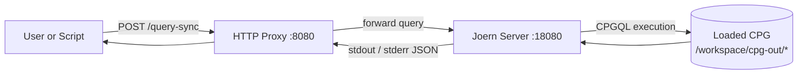

# Joern language shortcuts (for `joern-parse --language`)

This directory contains the Python HTTP client for Joern (see `joern_server/client.py`), plus a small amount of CLI glue.

When building a CPG in this repo, the key step is usually `joern-parse` (wrapped by `scripts/parse-and-serve.sh`). `joern-parse` can be instructed which frontend/parser to use via `--language <ARG>`.

## Joern HTTP endpoint flow



## Mapping table

From Joern’s “Frontends” documentation, the following `--language` arguments are supported for `joern-parse`:

| Language   | `joern-parse --language` value |
| ---------- | ------------------------------ |
| C          | `C`                            |
| C#         | `CSHARPSRC`                    |
| Ghidra     | `GHIDRA`                       |
| Golang     | `GOLANG`                       |
| Java       | `JAVASRC` or `JAVA`            |
| Javascript | `JAVASCRIPT`                   |
| Kotlin     | `KOTLIN`                       |
| PHP        | `PHP`                          |
| Python     | `PYTHONSRC`                    |
| Ruby       | `RUBYSRC`                      |
| Swift      | `SWIFTSRC`                     |

Reference: https://docs.joern.io/frontends

## How this repo uses it

The helper script `scripts/parse-and-serve.sh` accepts an optional second argument:

```bash
./scripts/parse-and-serve.sh /absolute/path/to/source <language>
```

It forwards `<language>` directly to:

```bash
joern-parse /workspace/mnt/source --language "<language>"
```

For larger C# CPGs, the parse step is usually not the bottleneck. The more common failure mode is importing that CPG into the long-running Joern HTTP server with too little JVM heap. Start the service with at least `JOERN_JAVA_XMX=8g` and `JOERN_MEMORY_LIMIT=12g` when you plan to run `reachableByFlows` queries.

### Examples

```bash
# C
./scripts/parse-and-serve.sh "$PWD/samples/c" C

# C#
./scripts/parse-and-serve.sh "/abs/path/to/dotnet-project" CSHARPSRC

# Java
./scripts/parse-and-serve.sh "/abs/path/to/java-src" JAVA
```

## Notes about `joern-scan`

`joern-scan` (used by `scripts/joern-scan-batch.sh`) does not expose a dedicated `--language` flag in the Joern CLI docs.

Instead, it generates a CPG for the input and runs Joern Scan’s built-in query bundle. In practice, you typically:

- let it auto-detect based on file extensions, or
- build a CPG explicitly with `joern-parse --language ...` if you need to force a frontend.

## Querying imported CPGs

When using the HTTP service, avoid repeating `importCpg(...)` in every request for exploratory or data-flow-heavy work. Import once, then run your follow-up selectors and `reachableByFlows` queries in later requests against the same server session.

### Convenience endpoints (unified container)

When running the NeuralAtlas unified container, the HTTP layer is fronted by a small proxy that also exposes:

- `GET /health` (returns a simple JSON status)
- `GET /version` (runs a cheap Joern `version` query)
- `POST /parse` (writes source to temp dir, runs `joern-parse`, outputs to `/workspace/cpg-out/<sample_id>`)

### Parse via HTTP

Use `POST /parse` when your orchestrator is remote and you cannot run local `docker compose run` commands.

Request body fields:

- `sample_id` (required): output key; final CPG path is `/workspace/cpg-out/<sample_id>`
- `source_code` (required): source text to parse
- `language` (optional): forwarded to `joern-parse --language`
- `filename` (optional): filename used inside temporary source directory
- `overwrite` (optional, default `false`): replace existing `/workspace/cpg-out/<sample_id>`

Example:

```bash
curl -s -u "joern:change-me" \
  -H "Content-Type: application/json" \
  -d '{
    "sample_id":"demo-c-001",
    "language":"C",
    "filename":"snippet.c",
    "source_code":"int main(){return 0;}",
    "overwrite":true
  }' \
  "http://127.0.0.1:${JOERN_PUBLISH_PORT:-8080}/parse" | jq .
```
